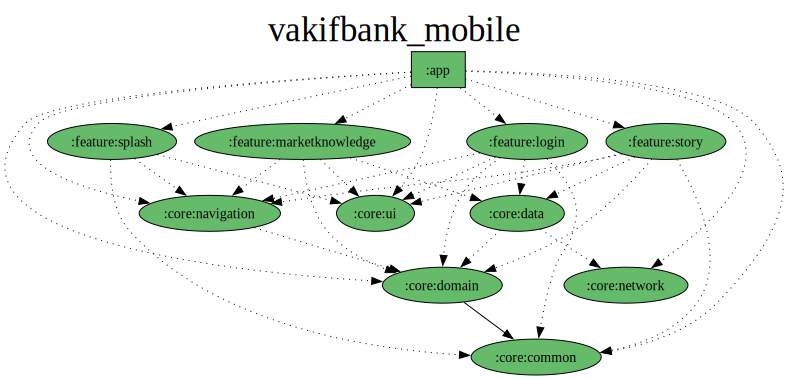

# VakıfBank Mobile Application Prototype

This project is a small prototype of the VakıfBank mobile application that I actively use. It has been developed with a multi-module structure following Clean Architecture principles. Due to time constraints, some fragments may still be under development.
## Dependency graph

---
## App Video
[](https://www.youtube.com/watch?v=hmPB7FN4ra8)

---

## Technologies Used

- **Kotlin + XML**: The primary language and layout structure of the application.
- **MVVM + MVI**: The project primarily follows the MVVM architecture while incorporating MVI concepts like unidirectional data flow, event handling, and effect management.
- **Dagger Hilt**: Used for dependency injection.
- **Glide**: Used for loading GIFs and images.
- **ExoPlayer**: Provides video playback functionality for the story view.
- **Retrofit**: Used to fetch market data and story content from a remote server.
- **Custom View**: Custom views were developed for the bottom bar and story view to enhance reusability.

---

## Modules

### 1. **App Module**
- The main module of the application.
- Contains all core functionalities and dependencies.
- The application is compiled and run from this module.

### 2. **Core Module**
- **Common**: Contains reusable code and components shared across different parts of the application. Helper classes, extensions, and shared functions reside here.
- **Navigation**: Includes the navigation graph file for the application.
- **Data**: Manages data and interacts with data sources.
- **Domain**: Contains business logic and rules, providing the core functionality of the application.
- **Network**: Handles network operations, API calls, and data transmission.
- **UI**: Designs the user interface, manages user interactions, and handles user interface components and resource files.

### 3. **Feature Modules**
- **Splash**: Contains the application's initial launch screen.
- **Login**: Handles user login and related functionalities.
- **Story**: Displays informative content in a story format. Shows videos or images fetched from a remote server.
- **MarketKnowledge**: Provides users with the latest prices of currencies and precious metals. This module enables users to access up-to-date market information.
---
## Features
- **Multilingual Support (Turkish & English)**: The application supports Turkish and English languages based on user preferences.

- **Dark Theme Support**:Users can switch between light and dark themes based on their preferences.

- **Compatible with API 24+ Devices**:The application is compatible with Android 7.0 (API 24) and above.
---
### Clone the Project
1. Clone this repository to your local machine using the following command:
   ```bash
   git clone https://github.com/your-repository/vakifbank-prototype.git
   
**Open the Project in Android Studio**
1. Open Android Studio.
2. Select Open an Existing Project.
3. Navigate to the cloned repository and select the project folder.

Add Your API Key
Visit [https://openexchangerates.org/](https://openexchangerates.org/) to obtain an API key.

Open the gradle.properties file in the root directory of the project.

Add your API key as follows:

    
    API_KEY=your_api_key_here

---

## Project Structure

The project is designed with a modular structure adhering to Clean Architecture principles. Each module serves a specific functionality and can be developed independently. This approach simplifies maintenance and scalability.

---

## Development Process

- **Splash Screen**: Designed as the application's launch screen. Welcomes the user when the app is opened.
- **Login Screen**: Handles user login operations. Includes necessary validations and processes for login.
- **Story Screen**: Displays videos or images fetched from a remote server using ExoPlayer and Glide.
- **MarketKnowledge Screen**: Fetches the latest prices of currencies and precious metals using Retrofit and presents them to the user.

---


**Note**: All visual elements of this application belong to VakıfBank. This application is only a prototype and does not serve any real-world purposes.
